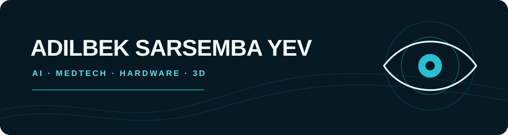

  
  
  

## about

I am an independent product builder working across AI, digital health, embedded hardware, computer vision, and interactive 3D.

My strongest interest is turning an idea into a complete product system: the device, firmware, data flow, interface, visual identity, and the experience people actually use.

## core skills

- **product systems:** research → prototype → interface → deployment
- **AI & data:** machine-learning workflows, computer vision, visual AI tools, explainable risk models
- **hardware:** ESP32, sensors, Wi-Fi APIs, device-to-web communication
- **creative engineering:** Three.js, Godot, WebGL, interactive 3D, simulations
- **product stack:** TypeScript, React, Next.js, Flutter, Python, Supabase

  

## featured projects

### OcuWave

**Connected ophthalmic platform — product, device and clinical software**

An end-to-end MedTech ecosystem for intraocular pressure monitoring: a connected handheld device, ESP32 firmware, Wi-Fi data transfer, clinician dashboard, patient records, measurement analysis, and an interactive 3D product experience.

### Neuralese Builder

**Visual AI environment — node graphs, learning workflows and simulations**

A Godot-based desktop application for building and learning neural networks through visual model graphs, dataset workflows, training orchestration, interactive simulations, and local runtime tools.

### CareLink

**Clinical monitoring and explainable risk workflows**

A healthcare workspace for patient data, clinician dashboards, and interpretable risk-assessment flows designed to support informed decisions rather than replace medical judgement.

### Extra AI

**Prompt enhancement for creators and developers**

A Flutter product and web experience for structuring, improving, and refining prompts for AI and coding assistants.

### Gesture Lab

**Computer vision interaction experiments**

Local prototypes for hand-gesture input, cursor control, body tracking, reaction recognition, and real-time 3D motion avatars.

## currently building

- OcuWave — bringing connected hardware and clinical software into one coherent product
- tools that make AI and technical learning more visual and accessible
- interactive experiences that make complex systems easier to understand

  

---

Open to meaningful collaborations in AI, healthcare technology, embedded systems, and interactive product design.
