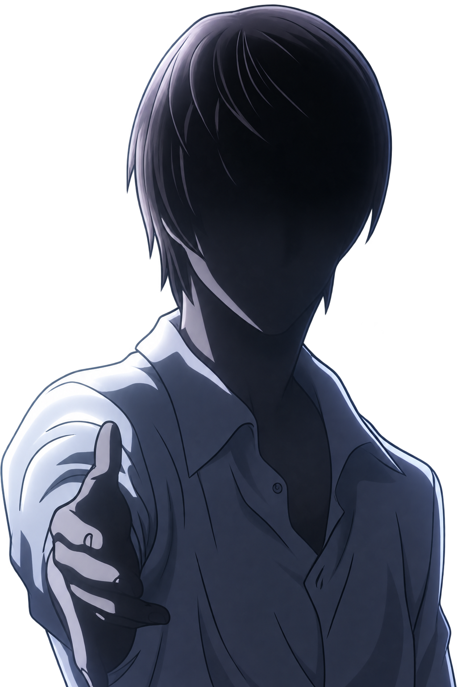

  <strong>ADILBEK SARSEMBAYEV</strong> 
  AI · MEDTECH · HARDWARE · INTERACTIVE 3D

  

01 **ABOUT**

Independent product builder from Kazakhstan. I turn early ideas into working systems: connected devices, firmware, data flows, interfaces, and the product experience around them.

I work where AI meets the physical world — digital health, computer vision, embedded hardware, and interactive 3D.

02 **TOOLKIT**

**AI & data** — Python, machine learning, computer vision, explainable risk models 
**Product & web** — TypeScript, React, Next.js, Flutter, Supabase 
**Hardware & 3D** — ESP32, sensors, Wi-Fi APIs, Godot, Three.js, WebGL

  

03 **SELECTED WORK**

**OcuWave** 
Connected ophthalmic platform for intraocular pressure monitoring — device, ESP32 firmware, Wi-Fi transfer, clinician dashboard, and 3D product experience.

**Neuralese Builder** 
Visual environment for building neural networks through model graphs, datasets, training workflows, and simulations.

**CareLink** 
Clinical monitoring workspace for patient data, dashboards, and explainable risk-assessment workflows.

**Extra AI** 
Prompt enhancement tool for creators and developers, built as a Flutter product with a web companion.

**Gesture Lab** 
Computer-vision prototypes for hand gestures, body tracking, reaction recognition, and motion avatars.

<strong>open the product map</strong>

 

| System | Focus | Stack |
| :-- | :-- | :-- |
| OcuWave | Connected ophthalmic device | ESP32 · Wi-Fi API · React · 3D |
| Neuralese Builder | Visual neural-network workspace | Godot · Graph editor · API |
| CareLink | Clinical data and risk workflows | Python · ML · Supabase |
| Extra AI | Prompt improvement product | Flutter · Next.js |
| Gesture Lab | Real-time visual interaction | Python · OpenCV · MediaPipe |

04 **NOW**

Building OcuWave and experimenting with tools that make complex technology easier to see, understand, and use.

05 **ACTIVITY**

  

  

Open to meaningful collaboration in AI, health technology, embedded systems, and product design.

  

